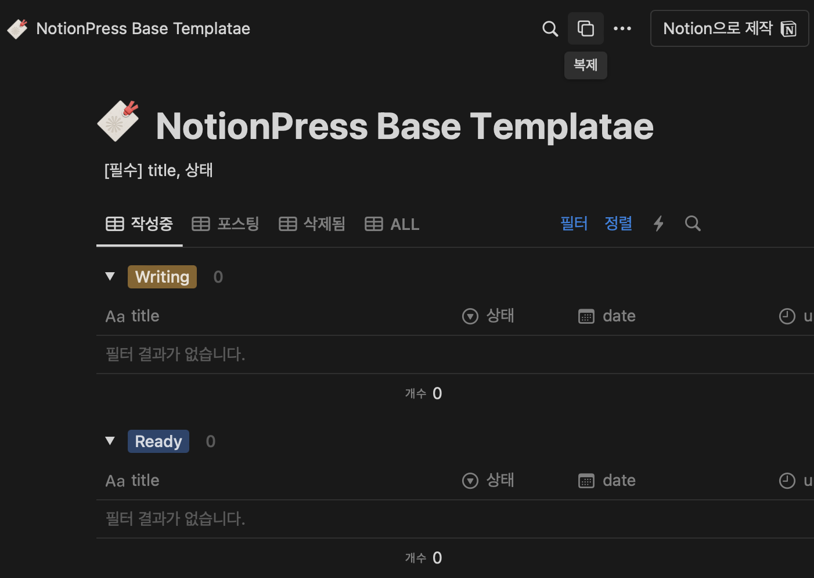
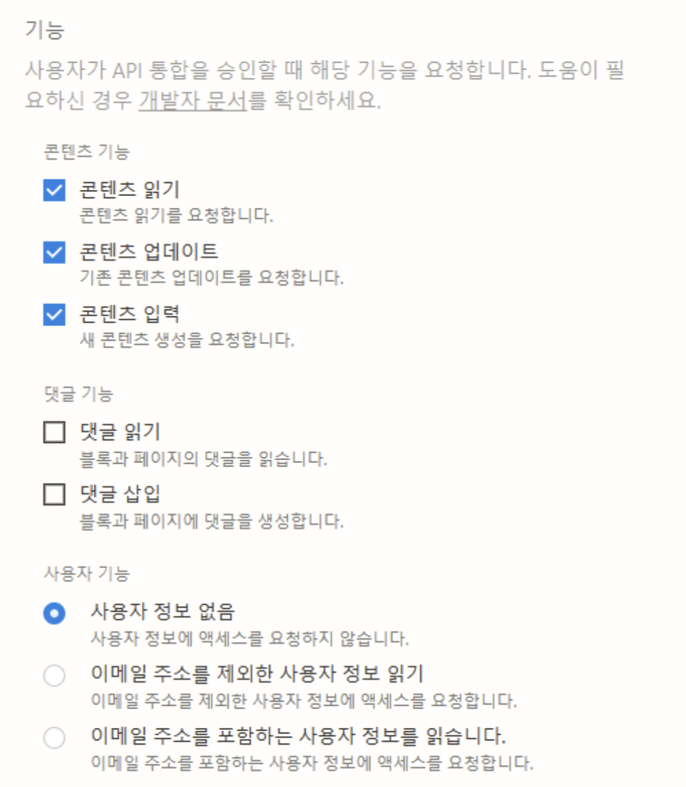
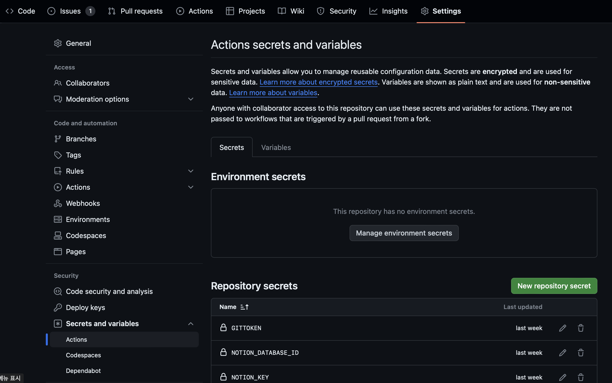

# nolog

## 소개

많은 개발자들이 한 번쯤은 "나만의 블로그를 운영해야지"라고 생각해본 적이 있을 겁니다. 하지만 실제로 블로그를 시작하고 유지하는 일은 상당한 도전과제입니다. 공부하고 개발하는 것만으로도 바쁜데, 여기에 글을 쓰고 관리하는 일은 때때로, 아니 항상 부담스러운 일입니다. 

노션으로 공부를 하는 개발자가 있습니다. 일을 하면서일수도 있고, 따로 짬을 내어 공부를 하면서일수도 있습니다. 그러다가 한 번 쯤은 생각하게 됩니다. 노션으로 한 공부나 작업 기록이 블로그에 자동으로 업로드된다면 좋을텐데!

저 역시 마찬가지입니다. 저는 귀찮은 일이 너무 귀찮습니다. 공부나 블로그나 어차피 한 번에 할 수 있는거 아닌가? 공부만 하면 포스팅이 되면 안되나? 왜 똑같은 일을 두 번 세 번 해야 하는걸까?

####  그래서 만들었습니다. 
nolog는 노션에 집중해서 작업하거나 공부해서 기록하는 것만으로도 그 내용이 자동으로 마크다운으로 변환되어 GitHub 기반의 블로그에 포스팅될 수 있도록 해주는 프로그램입니다. 취업 준비, 지식 공유, 개인 브랜딩 등 여러 목적으로 블로그를 운영하고자 하는 분들에게 nolog는 시간과 노력을 크게 절약해 줄 것입니다.

## 시작하기
### Notion 준비

1. 노션 계정을 준비합니다.
1. [Base Template](https://www.notion.so/248d5b9bf2a644b4b25485c828d5b04f?pvs=21)을 내 노션으로 복제합니다. 
   
2. 복제된 페이지에서 공유 - 링크 복사를 눌러 페이지의 주소를 얻습니다. 해당 주소는 `username.notion.site/NOTION_PAGE_ID` 꼴입니다. `NOTION_PAGE_ID`를 기록합니다. 
3. [Notion API 관리 페이지](https://www.notion.so/my-integrations)에서 `새 API 통합 만들기` 를 선택해 API를 생성해줍니다. 워크스페이스별로 권한을 관리하므로, 정확한 워크스페이스를 선택하여 진행합니다. 
4. `프라이빗 API 통합 시크릿키`를 기록합니다. 
5. 콘텐츠 기능은 읽기/업데이트/입력을 필수로 선택해야 합니다. 
  

1. 노션에서 연결된 워크스페이스를 선택하고, 위에서 만든 통합 API를 연결해줍니다. 
   

### 프로젝트 준비
1. 이 저장소의 별표를 누르고 여러분의 프로필로 포크합니다. 그 후 로컬로 클론합니다. 
2. (Optional) github.io 기반의 블로그 저장소를 준비합니다.
3. `.env.example` 파일의 이름을 `.env`로 변경하고 설정값들을 세팅합니다. 
   - NOTION-KEY : 프라이빗 API 통합 시크릿키를 입력합니다. 
   - NOTION_DATABASE_ID : NOTION_PAGE_ID를 입력합니다.
   - BLOG_URL : 깃허브 블로그의 URL을 입력합니다. 노션 페이지 링크를 실제 블로그 링크로 변경하는데 사용됩니다. 
   - SAVE_DIR : 콘텐츠들이 저장될 디렉토리입니다. github.io 블로그의 저장소에서 포스팅될 마크다운들이 저장될 디렉토리입니다. 
   - SAVE_SUB_DIR (Optional) : 포스트들이 저장될 하위 디렉토리입니다. 노션 페이지의 프로퍼티들로 정의합니다. 예를 들어 date/tag/로 입력한 경우, date와 tag가 노션 페이지의 속성에 존재해야 합니다. 
   - BLOG_REPO : 블로그 레포지토리의 경로입니다. 
   - GIT_USER_NAME : 깃허브 User Name 입니다. 
   - GIT_USER_EMAIL : 깃허브 User Email 입니다. 
1. 저장소를 내려 받은 곳에서 다음의 명령어를 사용합니다. 
   - nvm use
   - npm install
   - npm install -g ts-node
  여기까지 세팅 후 ts-node index.ts를 실행합니다. 메타데이터 파일이 초기화됩니다. 초기화된 메타데이터를 저장소에 커밋/푸쉬합니다.

## 사용법
포스팅은 상태값을 기준으로 작동합니다. 상태값의 정의는 다음과 같습니다. 
   - Writting : 작성중인 글입니다. 블로그에 반영되지 않습니다. 
   - Ready : Ready 상태의 글은 프로그램이 실행되면 마크다운으로 변환됩니다. 변환 된 후, updated 상태로 바뀝니다. 
   - Updated : 마크다운 변환이 완료된 글입니다. 
   - ToBeDeleted : 삭제할 글입니다. 타겟 디렉토리 안의 해당하는 마크다운 파일을 삭제합니다. 
   - Deleted : 삭제된 글입니다. 

노션에 원하는대로 글을 작성하고, 적당한 상태값을 설정한 뒤 `ts-node index.ts`로 프로그램을 실행하면 지정한 디렉토리에 마크다운 파일이 저장됩니다. 

## 추가기능 - 블로그 자동 배포 (Optional)
로컬에서만 사용해도 노션 글을 마크다운으로 바꿔주는 기능을 갖고 있지만, github.io 기반의 블로그 자동 배포도 가능합니다. 이를 위해서 깃허브 액션을 사용합니다. 

### Git Token 발행
깃허브의  `Settings` - `Developer Settings` - `Personal Access Token` 메뉴에서 토큰을 발행해야 합니다. 

### 변수 설정
레포지토리에 Secrets와 Variables를 설정해줘야 합니다. 

저장소의 `Settings` - `Secrets and varaibles` - `Actions` 에서 깃허브 액션에 필요한 환경변수를 설정할 수 있습니다. 
- Secrtes
  GITTOKEN, NOTION_DATABASE_ID, NOTION_KEY를 생성 해줍니다. GITTOKEN은 방금 발행한 Git Token 값이며, 나머지는 환경변수에 입력한 것과 동일한 값입니다. 
- Varaiables
  BLOG_REPO, BLOG_URL, GIT_USER_EMAIL, GIT_USER_NAME, SAVE_DIR를 생성합니다. 환경변수 입력과 동일한 값입니다. 

### 워크플로우 설정

깃허브 기반의 블로그 배포는 사용하는 테마에 따라 방법이 완전히 다릅니다. 따라서 깃허브 액션 워크플로우를 자동 배포까지 하는 경우, 자동 배포는 별도로 구성하여 블로그 저장소에 커밋/푸쉬까지만 하면 되는 케이스별로 구분해두었습니다. 

포크를 한 경우에는 기본적으로 워크플로우가 비활성화 되어있습니다. 원하는 워크플로우 고른 후 활성화 해주면 됩니다. 

#### 블로그 저장소에 커밋/푸쉬까지만 자동화하는 워크플로우
`workflow_2.yml.disabled` 워크플로우를 사용하면 됩니다. 파일 이름에서 .disabled를 제거해야 합니다. 
노션에서 글을 가져와 깃허브 블로그 레포지토리에 마크다운 파일을 집어넣고 커밋/푸쉬 하는 것까지 자동화 되어있습니다. 

#### 블로그 배포까지 자동화하는 워크플로우
`main.yml` 파일의 `blog-deploy` Job을 참조해서 워크플로우를 각자 블로그 배포 형식에 맞게 수정하면 됩니다. 해당 파일은 제가 실제로 배포에 사용하는 파일입니다. 

## 개발과정
[개발과정 몰아보기](https://sharknia.github.io/series/GitHub-Pages와-Notion-API-연동/)